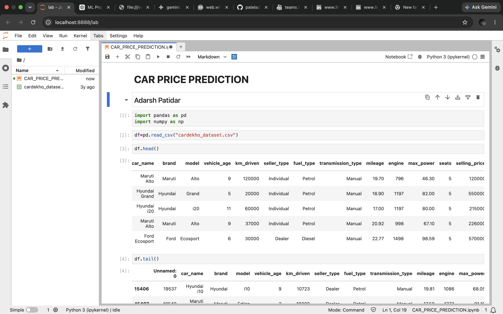
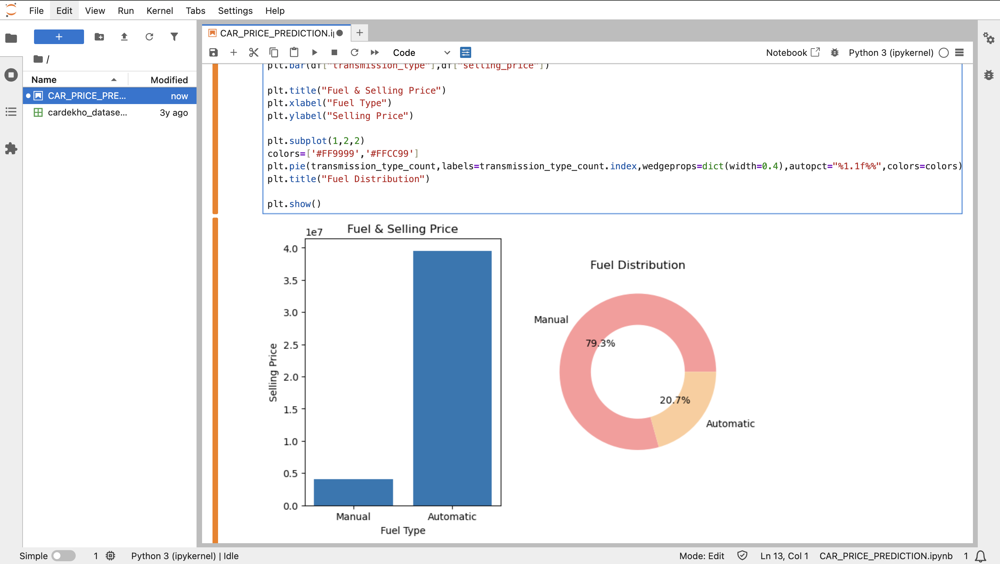
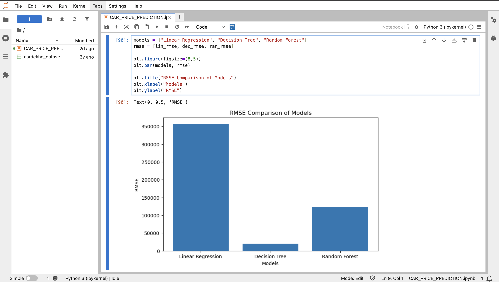
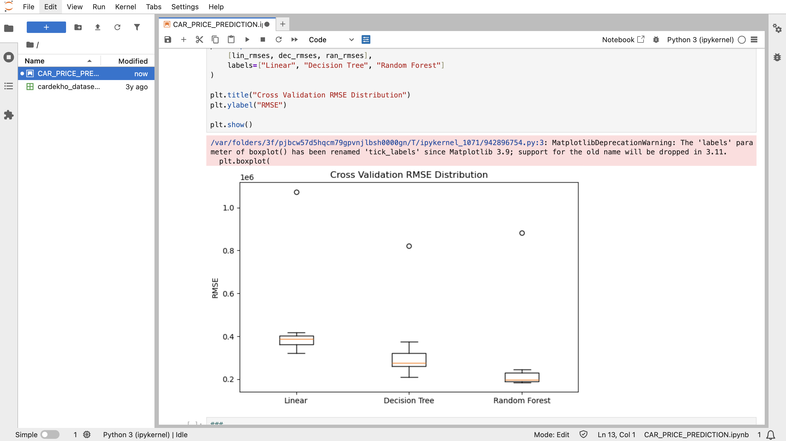
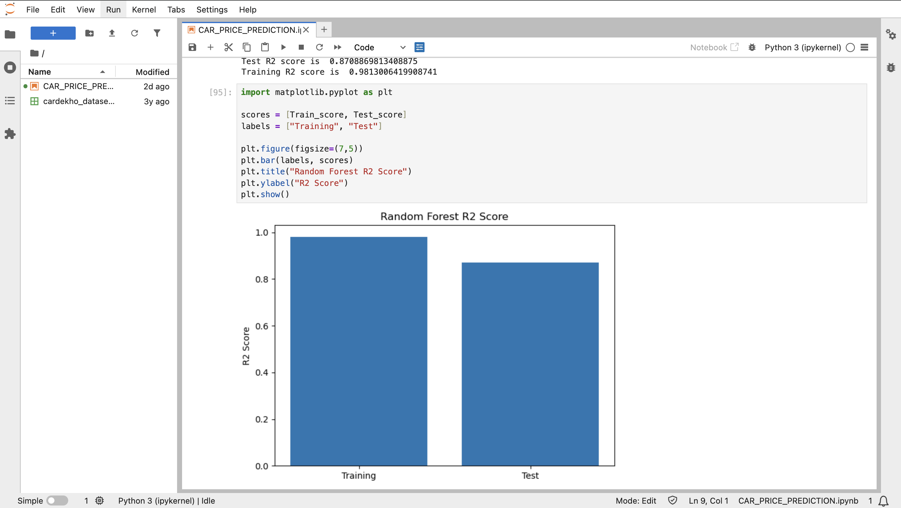
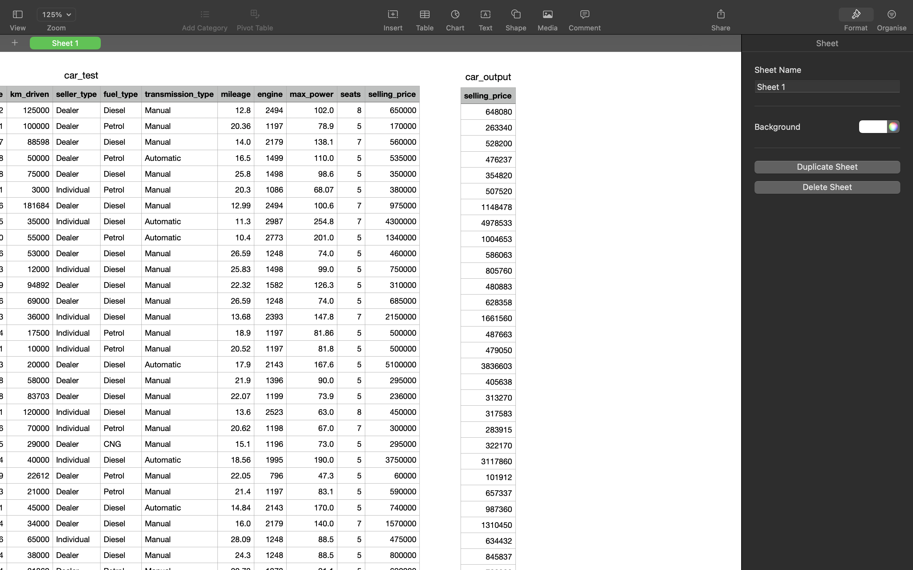
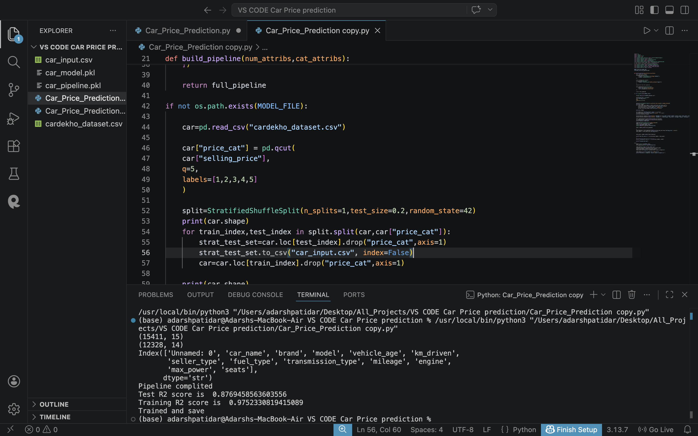

# 🚗 Car Price Prediction using Machine Learning

## 📌 Project Overview

This project predicts the selling price of used cars using Machine Learning. The dataset is preprocessed with a Scikit-learn pipeline, and multiple regression models are evaluated to select the best-performing model.

The final model uses **Random Forest Regressor**, which achieved the highest prediction accuracy among the tested models.

---

## ✨ Features

- Data Cleaning & Preprocessing
- Exploratory Data Analysis (EDA)
- Feature Engineering
- Pipeline using Scikit-learn
- Model Comparison
  - Linear Regression
  - Decision Tree Regressor
  - Random Forest Regressor
- Cross Validation
- RMSE & R² Score Evaluation
- Predict Selling Price for New Car Data
- Export Predictions to CSV

---

## 📂 Dataset

- **Dataset:** Cardekho Used Car Dataset
- **Target Variable:** `selling_price`

---

## 🛠️ Technologies Used

- Python
- Pandas
- NumPy
- Scikit-learn
- Matplotlib
- Joblib
- Jupyter Notebook

---

## 🤖 Machine Learning Models

- Linear Regression
- Decision Tree Regressor
- Random Forest Regressor ✅ (Best Model)

---

## 📊 Model Performance

### Training R² Score

**0.9752**

### Test R² Score

**0.8769**

Random Forest achieved the highest performance and was selected as the final prediction model.

---

## 📈 Evaluation Metrics

- Root Mean Squared Error (RMSE)
- Cross Validation RMSE
- R² Score

---

## 📸 Project Screenshots

### Dataset Preview



---

### Fuel Distribution



---

### RMSE Comparison



---

### Cross Validation RMSE



---

### R² Score Comparison



---

### Input & Output Prediction



---

### Training Output



---

## 📁 Project Structure

```
Car-Price-Prediction/
│
├── CAR_PRICE_PREDICTION.ipynb
├── Car_Price_Prediction.py
├── cardekho_dataset.csv
├── car_input.csv
├── car_output.csv
├── requirements.txt
├── README.md
└── screenshots/
```

---

## ▶️ How to Run

### Clone Repository

```bash
git clone https://github.com/your-username/Car-Price-Prediction.git
```

### Install Dependencies

```bash
pip install -r requirements.txt
```

### Train the Model

```bash
python Car_Price_Prediction.py
```

### Predict on New Data

Replace the values inside **car_input.csv** and run:

```bash
python Car_Price_Prediction.py
```

Predictions will be saved to:

```
car_output.csv
```

---

## 📌 Future Improvements

- Deploy using Streamlit
- Flask API Integration
- Hyperparameter Tuning
- Feature Selection
- XGBoost Model
- LightGBM Model

---

## 👨‍💻 Author

**Adarsh Patidar**

- 📧 Email: pateladarsh07261@gmail.com
- 💼 LinkedIn: https://www.linkedin.com/in/adarsh-patidar-500109369/
- 💻 GitHub: https://github.com/pateladarsh07261-collab
---

⭐ If you found this project useful, don't forget to star the repository.