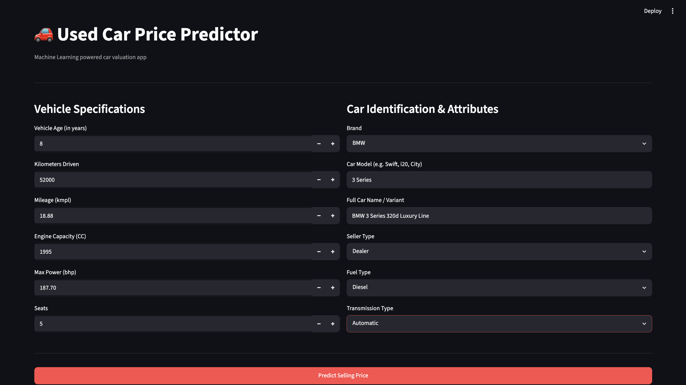
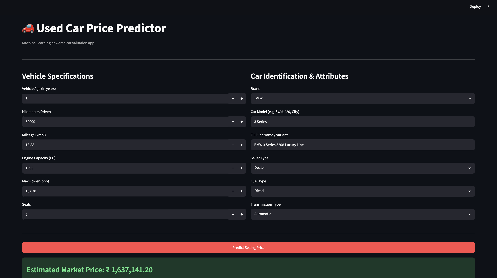

# 🚗 Car Dekho Price Prediction

An end-to-end Machine Learning web application to predict used car market selling prices using Scikit-Learn pipelines and Random Forest Regressor, deployed with Streamlit.

📌 Project Overview
Buying and selling used cars involves high variance in valuation based on factors like age, fuel type, transmission, kilometers driven, and engine specifications. This project covers the full ML workflow—from stratified sampling and feature transformation pipelines to an interactive web app.

📊 Features & Preprocessing
Stratified Split: Target price ko 5 quantiles me divide karke StratifiedShuffleSplit use kiya taaki train aur test sets me price distribution balanced rahe.
Pipeline Architecture:
Numeric Features: SimpleImputer (median) + StandardScaler
Categorical Features: OneHotEncoder(handle_unknown='ignore')
Dono ko Scikit-learn ke ColumnTransformer se ek unified pipeline me pack kiya gaya hai.
Model: Random Forest Regressor jo lowest RMSE aur high R² score deta hai.
🚀 How to Run Locally
Bash

# 1. Clone repository
git clone [https://github.com/pateladarsh07261-collab/Car-Price-Prediction.git]
(https://github.com/pateladarsh07261-collab/Car-Price-Prediction.git)cd Car-Price-Prediction
# 2. Install requirements
pip install -r requirements.txt
# 3. Run application
streamlit run app.py
📁 Repository Files
app.py: Streamlit frontend application
CAR_PRICE_PREDICTION.ipynb: Complete data analysis & training notebook
cardekho_dataset.csv: Dataset used for training
full_pipeline.pkl: Preprocessing pipeline artifact
random_forest_car_model.pkl: Trained Random Forest model
car_options.pkl: Dropdown mappings for the UI
requirements.txt: Required Python packages 
